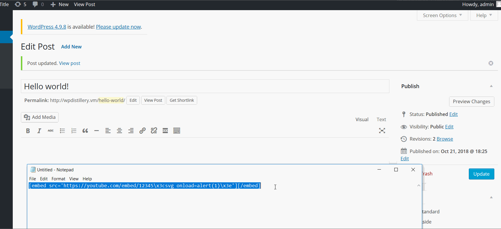
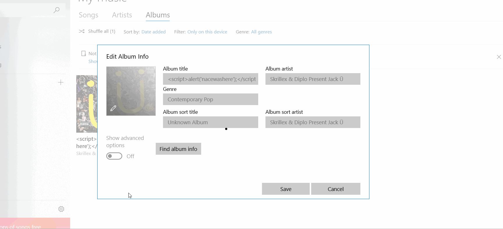
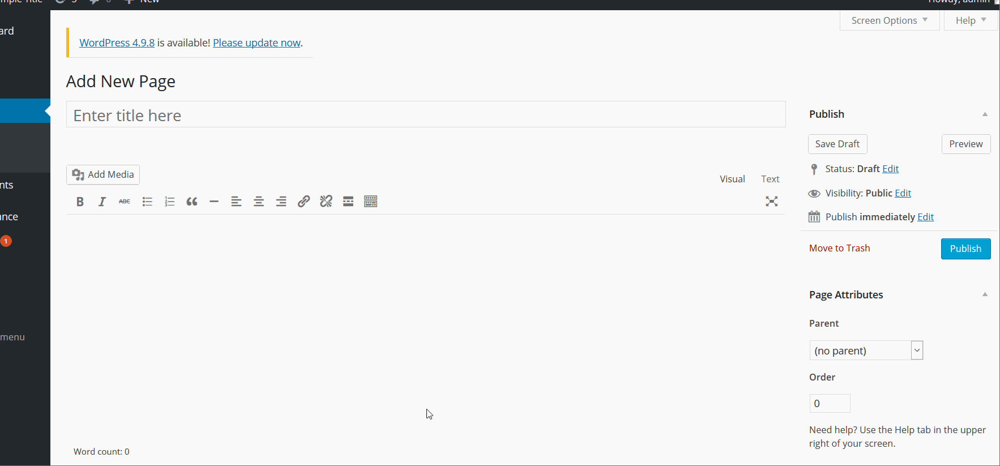

# Project 7 - WordPress Pentesting

Time spent: **15** hours spent in total

> Objective: Find, analyze, recreate, and document **five vulnerabilities** affecting an old version of WordPress

## Pentesting Report

1. (Required) Authenticated Stored Cross-Site Scripting (XSS) in YouTube URL Embeds
  - [ ] Summary: it allows authenticated user to inject HTML via embeded Youtube URL.
    - Vulnerability types: stored cross-site scripting
    - Tested in version: 4.2
    - Fixed in version: 4.2.13
  - [ ] GIF Walkthrough:
 

 
  - [ ] Steps to recreate: wpscan to find a vulnerability, create a new post and put this embed statement as a content of the post:
[embed src='https://youtube.com/embed/12345\x3csvg onload=alert(1)\x3e'][/embed]
  - [ ] Affected source code:
    - [Link 1](https://core.trac.wordpress.org/browser/branches/4.2/src/wp-includes/class-wp-embed.php)
1. (Required) Authenticated Cross-Site Scripting (XSS) via Media File Metadata
  - [ ] Summary: allows authenticated user to inject HTML via incorrectly handled file track information
    - Vulnerability types: stored cross site scripting
    - Tested in version: 4.2
    - Fixed in version: 4.2.13
  - [ ] GIF Walkthrough:
 

  - [ ] Steps to recreate: wpscan to find the vulnerability, edit metadata of mp3 file with Groove, put in any field  and upload this mp3 file to wp 
  - [ ] Affected source code:
    - [Link 1](https://core.trac.wordpress.org/browser/branches/4.2/src/wp-includes/media.php)
1. (Required) Nav Menu Title Cross-Site Scripting (XSS)
  - [ ] Summary: allows authenticated user to inject HTML via a title field.
    - Vulnerability types: stored cross site scripting
    - Tested in version:4.2
    - Fixed in version: 4.2.4
  - [ ] GIF Walkthrough:
 
 

  - [ ] Steps to recreate: wpscan to find the vulnerability, create a new page, and put the following for the page title:
<a onmouseover=alert('nacewashere')>Hoover over
  - [ ] Affected source code:
    - [Link 1](https://core.trac.wordpress.org/browser/branches/4.2/src/wp-admin/js/nav-menu.js)

## Assets

List any additional assets, such as scripts or files

## Resources

- [WordPress Source Browser](https://core.trac.wordpress.org/browser/)
- [WordPress Developer Reference](https://developer.wordpress.org/reference/)

GIFs created with [LiceCap](http://www.cockos.com/licecap/).

## Notes

Describe any challenges encountered while doing the work

## License

    Copyright [yyyy] [name of copyright owner]

    Licensed under the Apache License, Version 2.0 (the "License");
    you may not use this file except in compliance with the License.
    You may obtain a copy of the License at

        http://www.apache.org/licenses/LICENSE-2.0

    Unless required by applicable law or agreed to in writing, software
    distributed under the License is distributed on an "AS IS" BASIS,
    WITHOUT WARRANTIES OR CONDITIONS OF ANY KIND, either express or implied.
    See the License for the specific language governing permissions and
    limitations under the License.
